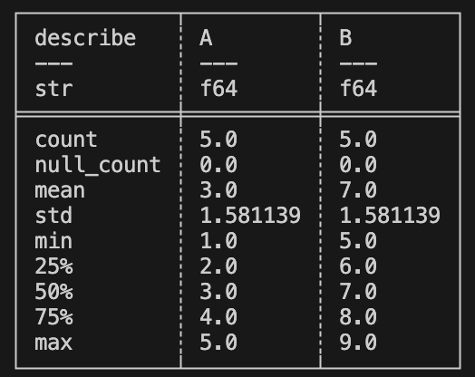

# Polars Descriptive Statistics Script

This project is a basic demonstration of using the Polars library in Python to compute descriptive statistics from a CSV data sample. The script loads the data, computes the statistics, and prints the results to the console.

## Prerequisites

Ensure you have the following installed:
- Python (3.x recommended)
- Polars (`pip install Polars`)

## Files

1. * Polars_package/main.py**:
   - Contains the primary script for loading data and computing descriptive statistics.
   
2. **tests/test_main.py**:
   - Contains unit tests for the main functionality.
   
3. **data/data_sample.csv**:
   - A sample CSV data file.

## Usage

1. Clone the repository to your local machine.
2. Navigate to the directory containing the files.
3. To view the descriptive statistics, run:
```bash
python Polars_package/main.py
```
4. To run the unit tests, run:
```bash
python -m unittest tests.test_main
```

## Results

Here are some visual results based on the analysis:




